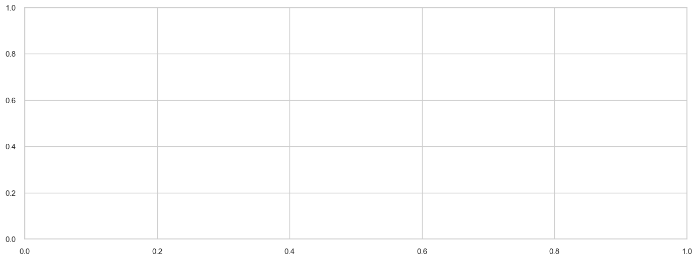
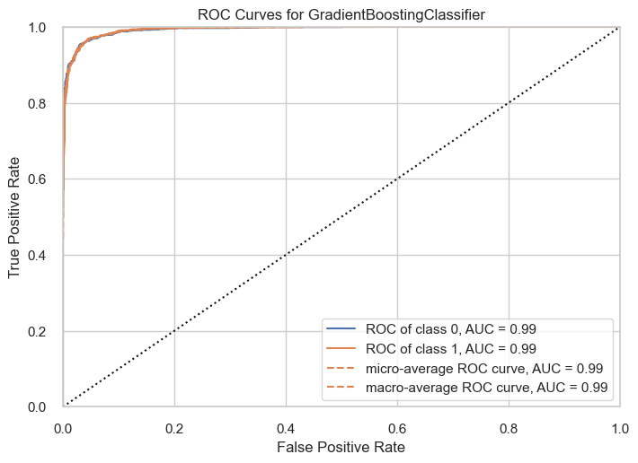
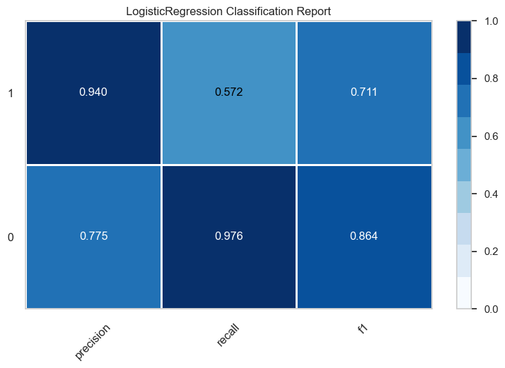
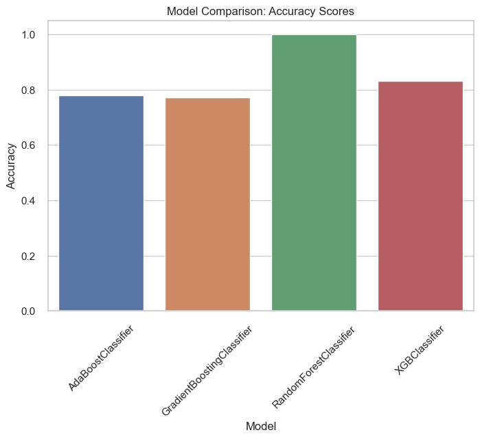

# Models Evaluation and Prediction

### Data preprocessing


```python
import pandas as pd
from sklearn.model_selection import train_test_split
from sklearn.tree import DecisionTreeClassifier
from sklearn.ensemble import RandomForestClassifier
from sklearn.linear_model import LogisticRegression
from sklearn.metrics import accuracy_score, precision_score, recall_score, f1_score, roc_auc_score
from sklearn.preprocessing import LabelEncoder
```


```python
# Loading sample dataset
df = pd.read_csv('GooglePlayStore_cleaned.csv')
```


```python
df.info()
```

    <class 'pandas.core.frame.DataFrame'>
    RangeIndex: 10355 entries, 0 to 10354
    Data columns (total 14 columns):
     #   Column          Non-Null Count  Dtype  
    ---  ------          --------------  -----  
     0   App             10355 non-null  object 
     1   Category        10355 non-null  object 
     2   Rating          10355 non-null  float64
     3   Reviews         10355 non-null  float64
     4   Size            10355 non-null  float64
     5   Installs        10355 non-null  int64  
     6   Type            10355 non-null  object 
     7   Price           10355 non-null  float64
     8   Content Rating  10355 non-null  object 
     9   Genres          10355 non-null  object 
     10  Current Ver     10355 non-null  object 
     11  Android Ver     10355 non-null  object 
     12  Month           10355 non-null  object 
     13  Year            10355 non-null  int64  
    dtypes: float64(4), int64(2), object(8)
    memory usage: 1.1+ MB
    

#### The "Installs" column represents the number of installations for each app , which can be considered as an indicator of app success. So apps with "Installs" greater than 1,000,000 consider as successful.


```python
# Create a new binary column "success" based on the number of installs
df['Success'] = 0
df.loc[df['Installs'] >= 1000000,  'Success'] = 1
df.head()
```


<div>
<style scoped>
    .dataframe tbody tr th:only-of-type {
        vertical-align: middle;
    }

    .dataframe tbody tr th {
        vertical-align: top;
    }

    .dataframe thead th {
        text-align: right;
    }
</style>
<table border="1" class="dataframe">
  <thead>
    <tr style="text-align: right;">
      <th></th>
      <th>App</th>
      <th>Category</th>
      <th>Rating</th>
      <th>Reviews</th>
      <th>Size</th>
      <th>Installs</th>
      <th>Type</th>
      <th>Price</th>
      <th>Content Rating</th>
      <th>Genres</th>
      <th>Current Ver</th>
      <th>Android Ver</th>
      <th>Month</th>
      <th>Year</th>
      <th>Success</th>
    </tr>
  </thead>
  <tbody>
    <tr>
      <th>0</th>
      <td>Photo Editor &amp; Candy Camera &amp; Grid &amp; ScrapBook</td>
      <td>ART_AND_DESIGN</td>
      <td>4.1</td>
      <td>159.0</td>
      <td>19.0</td>
      <td>10000</td>
      <td>Free</td>
      <td>0.0</td>
      <td>Everyone</td>
      <td>Art &amp; Design</td>
      <td>1.0.0</td>
      <td>4.0.3 and up</td>
      <td>January</td>
      <td>2018</td>
      <td>0</td>
    </tr>
    <tr>
      <th>1</th>
      <td>Coloring book moana</td>
      <td>ART_AND_DESIGN</td>
      <td>3.9</td>
      <td>967.0</td>
      <td>14.0</td>
      <td>500000</td>
      <td>Free</td>
      <td>0.0</td>
      <td>Everyone</td>
      <td>Art &amp; Design;Pretend Play</td>
      <td>2.0.0</td>
      <td>4.0.3 and up</td>
      <td>January</td>
      <td>2018</td>
      <td>0</td>
    </tr>
    <tr>
      <th>2</th>
      <td>U Launcher Lite – FREE Live Cool Themes, Hide ...</td>
      <td>ART_AND_DESIGN</td>
      <td>4.7</td>
      <td>87510.0</td>
      <td>8.7</td>
      <td>5000000</td>
      <td>Free</td>
      <td>0.0</td>
      <td>Everyone</td>
      <td>Art &amp; Design</td>
      <td>1.2.4</td>
      <td>4.0.3 and up</td>
      <td>August</td>
      <td>2018</td>
      <td>1</td>
    </tr>
    <tr>
      <th>3</th>
      <td>Sketch - Draw &amp; Paint</td>
      <td>ART_AND_DESIGN</td>
      <td>4.5</td>
      <td>215644.0</td>
      <td>25.0</td>
      <td>50000000</td>
      <td>Free</td>
      <td>0.0</td>
      <td>Teen</td>
      <td>Art &amp; Design</td>
      <td>Varies with device</td>
      <td>4.2 and up</td>
      <td>June</td>
      <td>2018</td>
      <td>1</td>
    </tr>
    <tr>
      <th>4</th>
      <td>Pixel Draw - Number Art Coloring Book</td>
      <td>ART_AND_DESIGN</td>
      <td>4.3</td>
      <td>967.0</td>
      <td>2.8</td>
      <td>100000</td>
      <td>Free</td>
      <td>0.0</td>
      <td>Everyone</td>
      <td>Art &amp; Design;Creativity</td>
      <td>1.1</td>
      <td>4.4 and up</td>
      <td>June</td>
      <td>2018</td>
      <td>0</td>
    </tr>
  </tbody>
</table>
</div>


```python
df['Success'].value_counts().sort_index()
```


    0    6302
    1    4053
    Name: Success, dtype: int64


```python
# Encode the 'Category','Content Rating','Genres','Type' features using LabelEncoder
le = LabelEncoder()
df['Category'] = le.fit_transform(df['Category'])
df['Content Rating'] = le.fit_transform(df['Content Rating'])
df['Genres'] = le.fit_transform(df['Genres'])
df['Type'] = le.fit_transform(df['Type'])
```


```python
# Choose predict columns
df = df[['Category', 'Rating', 'Reviews', 'Size', 'Type', 'Price', 'Content Rating', 'Genres', 'Success']]
df
```


<div>
<style scoped>
    .dataframe tbody tr th:only-of-type {
        vertical-align: middle;
    }

    .dataframe tbody tr th {
        vertical-align: top;
    }

    .dataframe thead th {
        text-align: right;
    }
</style>
<table border="1" class="dataframe">
  <thead>
    <tr style="text-align: right;">
      <th></th>
      <th>Category</th>
      <th>Rating</th>
      <th>Reviews</th>
      <th>Size</th>
      <th>Type</th>
      <th>Price</th>
      <th>Content Rating</th>
      <th>Genres</th>
      <th>Success</th>
    </tr>
  </thead>
  <tbody>
    <tr>
      <th>0</th>
      <td>0</td>
      <td>4.1</td>
      <td>159.0</td>
      <td>19.000000</td>
      <td>0</td>
      <td>0.0</td>
      <td>1</td>
      <td>9</td>
      <td>0</td>
    </tr>
    <tr>
      <th>1</th>
      <td>0</td>
      <td>3.9</td>
      <td>967.0</td>
      <td>14.000000</td>
      <td>0</td>
      <td>0.0</td>
      <td>1</td>
      <td>12</td>
      <td>0</td>
    </tr>
    <tr>
      <th>2</th>
      <td>0</td>
      <td>4.7</td>
      <td>87510.0</td>
      <td>8.700000</td>
      <td>0</td>
      <td>0.0</td>
      <td>1</td>
      <td>9</td>
      <td>1</td>
    </tr>
    <tr>
      <th>3</th>
      <td>0</td>
      <td>4.5</td>
      <td>215644.0</td>
      <td>25.000000</td>
      <td>0</td>
      <td>0.0</td>
      <td>4</td>
      <td>9</td>
      <td>1</td>
    </tr>
    <tr>
      <th>4</th>
      <td>0</td>
      <td>4.3</td>
      <td>967.0</td>
      <td>2.800000</td>
      <td>0</td>
      <td>0.0</td>
      <td>1</td>
      <td>11</td>
      <td>0</td>
    </tr>
    <tr>
      <th>...</th>
      <td>...</td>
      <td>...</td>
      <td>...</td>
      <td>...</td>
      <td>...</td>
      <td>...</td>
      <td>...</td>
      <td>...</td>
      <td>...</td>
    </tr>
    <tr>
      <th>10350</th>
      <td>11</td>
      <td>4.5</td>
      <td>38.0</td>
      <td>53.000000</td>
      <td>0</td>
      <td>0.0</td>
      <td>1</td>
      <td>39</td>
      <td>0</td>
    </tr>
    <tr>
      <th>10351</th>
      <td>11</td>
      <td>5.0</td>
      <td>4.0</td>
      <td>3.600000</td>
      <td>0</td>
      <td>0.0</td>
      <td>1</td>
      <td>39</td>
      <td>0</td>
    </tr>
    <tr>
      <th>10352</th>
      <td>20</td>
      <td>4.3</td>
      <td>3.0</td>
      <td>9.500000</td>
      <td>0</td>
      <td>0.0</td>
      <td>1</td>
      <td>71</td>
      <td>0</td>
    </tr>
    <tr>
      <th>10353</th>
      <td>3</td>
      <td>4.5</td>
      <td>114.0</td>
      <td>21.516165</td>
      <td>0</td>
      <td>0.0</td>
      <td>3</td>
      <td>19</td>
      <td>0</td>
    </tr>
    <tr>
      <th>10354</th>
      <td>18</td>
      <td>4.5</td>
      <td>398307.0</td>
      <td>19.000000</td>
      <td>0</td>
      <td>0.0</td>
      <td>1</td>
      <td>67</td>
      <td>1</td>
    </tr>
  </tbody>
</table>
<p>10355 rows × 9 columns</p>
</div>


# Pycaret


```python
# init setup
from pycaret.classification import *
s = setup(data=df, target = 'Success', session_id = 123)
```


<style type="text/css">
#T_7c396_row8_col1 {
  background-color: lightgreen;
}
</style>
<table id="T_7c396">
  <thead>
    <tr>
      <th class="blank level0" >&nbsp;</th>
      <th id="T_7c396_level0_col0" class="col_heading level0 col0" >Description</th>
      <th id="T_7c396_level0_col1" class="col_heading level0 col1" >Value</th>
    </tr>
  </thead>
  <tbody>
    <tr>
      <th id="T_7c396_level0_row0" class="row_heading level0 row0" >0</th>
      <td id="T_7c396_row0_col0" class="data row0 col0" >Session id</td>
      <td id="T_7c396_row0_col1" class="data row0 col1" >123</td>
    </tr>
    <tr>
      <th id="T_7c396_level0_row1" class="row_heading level0 row1" >1</th>
      <td id="T_7c396_row1_col0" class="data row1 col0" >Target</td>
      <td id="T_7c396_row1_col1" class="data row1 col1" >Success</td>
    </tr>
    <tr>
      <th id="T_7c396_level0_row2" class="row_heading level0 row2" >2</th>
      <td id="T_7c396_row2_col0" class="data row2 col0" >Target type</td>
      <td id="T_7c396_row2_col1" class="data row2 col1" >Binary</td>
    </tr>
    <tr>
      <th id="T_7c396_level0_row3" class="row_heading level0 row3" >3</th>
      <td id="T_7c396_row3_col0" class="data row3 col0" >Original data shape</td>
      <td id="T_7c396_row3_col1" class="data row3 col1" >(10355, 9)</td>
    </tr>
    <tr>
      <th id="T_7c396_level0_row4" class="row_heading level0 row4" >4</th>
      <td id="T_7c396_row4_col0" class="data row4 col0" >Transformed data shape</td>
      <td id="T_7c396_row4_col1" class="data row4 col1" >(10355, 9)</td>
    </tr>
    <tr>
      <th id="T_7c396_level0_row5" class="row_heading level0 row5" >5</th>
      <td id="T_7c396_row5_col0" class="data row5 col0" >Transformed train set shape</td>
      <td id="T_7c396_row5_col1" class="data row5 col1" >(7248, 9)</td>
    </tr>
    <tr>
      <th id="T_7c396_level0_row6" class="row_heading level0 row6" >6</th>
      <td id="T_7c396_row6_col0" class="data row6 col0" >Transformed test set shape</td>
      <td id="T_7c396_row6_col1" class="data row6 col1" >(3107, 9)</td>
    </tr>
    <tr>
      <th id="T_7c396_level0_row7" class="row_heading level0 row7" >7</th>
      <td id="T_7c396_row7_col0" class="data row7 col0" >Numeric features</td>
      <td id="T_7c396_row7_col1" class="data row7 col1" >8</td>
    </tr>
    <tr>
      <th id="T_7c396_level0_row8" class="row_heading level0 row8" >8</th>
      <td id="T_7c396_row8_col0" class="data row8 col0" >Preprocess</td>
      <td id="T_7c396_row8_col1" class="data row8 col1" >True</td>
    </tr>
    <tr>
      <th id="T_7c396_level0_row9" class="row_heading level0 row9" >9</th>
      <td id="T_7c396_row9_col0" class="data row9 col0" >Imputation type</td>
      <td id="T_7c396_row9_col1" class="data row9 col1" >simple</td>
    </tr>
    <tr>
      <th id="T_7c396_level0_row10" class="row_heading level0 row10" >10</th>
      <td id="T_7c396_row10_col0" class="data row10 col0" >Numeric imputation</td>
      <td id="T_7c396_row10_col1" class="data row10 col1" >mean</td>
    </tr>
    <tr>
      <th id="T_7c396_level0_row11" class="row_heading level0 row11" >11</th>
      <td id="T_7c396_row11_col0" class="data row11 col0" >Categorical imputation</td>
      <td id="T_7c396_row11_col1" class="data row11 col1" >mode</td>
    </tr>
    <tr>
      <th id="T_7c396_level0_row12" class="row_heading level0 row12" >12</th>
      <td id="T_7c396_row12_col0" class="data row12 col0" >Fold Generator</td>
      <td id="T_7c396_row12_col1" class="data row12 col1" >StratifiedKFold</td>
    </tr>
    <tr>
      <th id="T_7c396_level0_row13" class="row_heading level0 row13" >13</th>
      <td id="T_7c396_row13_col0" class="data row13 col0" >Fold Number</td>
      <td id="T_7c396_row13_col1" class="data row13 col1" >10</td>
    </tr>
    <tr>
      <th id="T_7c396_level0_row14" class="row_heading level0 row14" >14</th>
      <td id="T_7c396_row14_col0" class="data row14 col0" >CPU Jobs</td>
      <td id="T_7c396_row14_col1" class="data row14 col1" >-1</td>
    </tr>
    <tr>
      <th id="T_7c396_level0_row15" class="row_heading level0 row15" >15</th>
      <td id="T_7c396_row15_col0" class="data row15 col0" >Use GPU</td>
      <td id="T_7c396_row15_col1" class="data row15 col1" >False</td>
    </tr>
    <tr>
      <th id="T_7c396_level0_row16" class="row_heading level0 row16" >16</th>
      <td id="T_7c396_row16_col0" class="data row16 col0" >Log Experiment</td>
      <td id="T_7c396_row16_col1" class="data row16 col1" >False</td>
    </tr>
    <tr>
      <th id="T_7c396_level0_row17" class="row_heading level0 row17" >17</th>
      <td id="T_7c396_row17_col0" class="data row17 col0" >Experiment Name</td>
      <td id="T_7c396_row17_col1" class="data row17 col1" >clf-default-name</td>
    </tr>
    <tr>
      <th id="T_7c396_level0_row18" class="row_heading level0 row18" >18</th>
      <td id="T_7c396_row18_col0" class="data row18 col0" >USI</td>
      <td id="T_7c396_row18_col1" class="data row18 col1" >6f95</td>
    </tr>
  </tbody>
</table>


```python
# model training and selection
best = compare_models(include=['lr', 'dt', 'rf', 'gbc', 'svm', 'ada', 'xgboost'])
```


<style type="text/css">
#T_6815f th {
  text-align: left;
}
#T_6815f_row0_col0, #T_6815f_row0_col2, #T_6815f_row0_col3, #T_6815f_row0_col4, #T_6815f_row1_col0, #T_6815f_row1_col1, #T_6815f_row1_col2, #T_6815f_row1_col3, #T_6815f_row1_col4, #T_6815f_row1_col5, #T_6815f_row1_col6, #T_6815f_row1_col7, #T_6815f_row2_col0, #T_6815f_row2_col1, #T_6815f_row2_col3, #T_6815f_row2_col4, #T_6815f_row2_col5, #T_6815f_row2_col6, #T_6815f_row2_col7, #T_6815f_row3_col0, #T_6815f_row3_col1, #T_6815f_row3_col2, #T_6815f_row3_col3, #T_6815f_row3_col4, #T_6815f_row3_col5, #T_6815f_row3_col6, #T_6815f_row3_col7, #T_6815f_row4_col0, #T_6815f_row4_col1, #T_6815f_row4_col2, #T_6815f_row4_col3, #T_6815f_row4_col5, #T_6815f_row4_col6, #T_6815f_row4_col7, #T_6815f_row5_col0, #T_6815f_row5_col1, #T_6815f_row5_col2, #T_6815f_row5_col3, #T_6815f_row5_col4, #T_6815f_row5_col5, #T_6815f_row5_col6, #T_6815f_row5_col7, #T_6815f_row6_col0, #T_6815f_row6_col1, #T_6815f_row6_col2, #T_6815f_row6_col4, #T_6815f_row6_col5, #T_6815f_row6_col6, #T_6815f_row6_col7 {
  text-align: left;
}
#T_6815f_row0_col1, #T_6815f_row0_col5, #T_6815f_row0_col6, #T_6815f_row0_col7, #T_6815f_row2_col2, #T_6815f_row4_col4, #T_6815f_row6_col3 {
  text-align: left;
  background-color: yellow;
}
#T_6815f_row0_col8, #T_6815f_row1_col8, #T_6815f_row2_col8, #T_6815f_row3_col8, #T_6815f_row4_col8, #T_6815f_row5_col8 {
  text-align: left;
  background-color: lightgrey;
}
#T_6815f_row6_col8 {
  text-align: left;
  background-color: yellow;
  background-color: lightgrey;
}
</style>
<table id="T_6815f">
  <thead>
    <tr>
      <th class="blank level0" >&nbsp;</th>
      <th id="T_6815f_level0_col0" class="col_heading level0 col0" >Model</th>
      <th id="T_6815f_level0_col1" class="col_heading level0 col1" >Accuracy</th>
      <th id="T_6815f_level0_col2" class="col_heading level0 col2" >AUC</th>
      <th id="T_6815f_level0_col3" class="col_heading level0 col3" >Recall</th>
      <th id="T_6815f_level0_col4" class="col_heading level0 col4" >Prec.</th>
      <th id="T_6815f_level0_col5" class="col_heading level0 col5" >F1</th>
      <th id="T_6815f_level0_col6" class="col_heading level0 col6" >Kappa</th>
      <th id="T_6815f_level0_col7" class="col_heading level0 col7" >MCC</th>
      <th id="T_6815f_level0_col8" class="col_heading level0 col8" >TT (Sec)</th>
    </tr>
  </thead>
  <tbody>
    <tr>
      <th id="T_6815f_level0_row0" class="row_heading level0 row0" >gbc</th>
      <td id="T_6815f_row0_col0" class="data row0 col0" >Gradient Boosting Classifier</td>
      <td id="T_6815f_row0_col1" class="data row0 col1" >0.9576</td>
      <td id="T_6815f_row0_col2" class="data row0 col2" >0.9918</td>
      <td id="T_6815f_row0_col3" class="data row0 col3" >0.9471</td>
      <td id="T_6815f_row0_col4" class="data row0 col4" >0.9450</td>
      <td id="T_6815f_row0_col5" class="data row0 col5" >0.9460</td>
      <td id="T_6815f_row0_col6" class="data row0 col6" >0.9112</td>
      <td id="T_6815f_row0_col7" class="data row0 col7" >0.9112</td>
      <td id="T_6815f_row0_col8" class="data row0 col8" >2.3790</td>
    </tr>
    <tr>
      <th id="T_6815f_level0_row1" class="row_heading level0 row1" >rf</th>
      <td id="T_6815f_row1_col0" class="data row1 col0" >Random Forest Classifier</td>
      <td id="T_6815f_row1_col1" class="data row1 col1" >0.9565</td>
      <td id="T_6815f_row1_col2" class="data row1 col2" >0.9904</td>
      <td id="T_6815f_row1_col3" class="data row1 col3" >0.9408</td>
      <td id="T_6815f_row1_col4" class="data row1 col4" >0.9480</td>
      <td id="T_6815f_row1_col5" class="data row1 col5" >0.9443</td>
      <td id="T_6815f_row1_col6" class="data row1 col6" >0.9087</td>
      <td id="T_6815f_row1_col7" class="data row1 col7" >0.9088</td>
      <td id="T_6815f_row1_col8" class="data row1 col8" >2.4760</td>
    </tr>
    <tr>
      <th id="T_6815f_level0_row2" class="row_heading level0 row2" >ada</th>
      <td id="T_6815f_row2_col0" class="data row2 col0" >Ada Boost Classifier</td>
      <td id="T_6815f_row2_col1" class="data row2 col1" >0.9563</td>
      <td id="T_6815f_row2_col2" class="data row2 col2" >0.9921</td>
      <td id="T_6815f_row2_col3" class="data row2 col3" >0.9401</td>
      <td id="T_6815f_row2_col4" class="data row2 col4" >0.9478</td>
      <td id="T_6815f_row2_col5" class="data row2 col5" >0.9438</td>
      <td id="T_6815f_row2_col6" class="data row2 col6" >0.9080</td>
      <td id="T_6815f_row2_col7" class="data row2 col7" >0.9081</td>
      <td id="T_6815f_row2_col8" class="data row2 col8" >2.4290</td>
    </tr>
    <tr>
      <th id="T_6815f_level0_row3" class="row_heading level0 row3" >xgboost</th>
      <td id="T_6815f_row3_col0" class="data row3 col0" >Extreme Gradient Boosting</td>
      <td id="T_6815f_row3_col1" class="data row3 col1" >0.9549</td>
      <td id="T_6815f_row3_col2" class="data row3 col2" >0.9907</td>
      <td id="T_6815f_row3_col3" class="data row3 col3" >0.9436</td>
      <td id="T_6815f_row3_col4" class="data row3 col4" >0.9415</td>
      <td id="T_6815f_row3_col5" class="data row3 col5" >0.9424</td>
      <td id="T_6815f_row3_col6" class="data row3 col6" >0.9053</td>
      <td id="T_6815f_row3_col7" class="data row3 col7" >0.9055</td>
      <td id="T_6815f_row3_col8" class="data row3 col8" >2.4560</td>
    </tr>
    <tr>
      <th id="T_6815f_level0_row4" class="row_heading level0 row4" >lr</th>
      <td id="T_6815f_row4_col0" class="data row4 col0" >Logistic Regression</td>
      <td id="T_6815f_row4_col1" class="data row4 col1" >0.9448</td>
      <td id="T_6815f_row4_col2" class="data row4 col2" >0.9890</td>
      <td id="T_6815f_row4_col3" class="data row4 col3" >0.8890</td>
      <td id="T_6815f_row4_col4" class="data row4 col4" >0.9677</td>
      <td id="T_6815f_row4_col5" class="data row4 col5" >0.9264</td>
      <td id="T_6815f_row4_col6" class="data row4 col6" >0.8824</td>
      <td id="T_6815f_row4_col7" class="data row4 col7" >0.8847</td>
      <td id="T_6815f_row4_col8" class="data row4 col8" >3.7110</td>
    </tr>
    <tr>
      <th id="T_6815f_level0_row5" class="row_heading level0 row5" >dt</th>
      <td id="T_6815f_row5_col0" class="data row5 col0" >Decision Tree Classifier</td>
      <td id="T_6815f_row5_col1" class="data row5 col1" >0.9369</td>
      <td id="T_6815f_row5_col2" class="data row5 col2" >0.9341</td>
      <td id="T_6815f_row5_col3" class="data row5 col3" >0.9210</td>
      <td id="T_6815f_row5_col4" class="data row5 col4" >0.9184</td>
      <td id="T_6815f_row5_col5" class="data row5 col5" >0.9196</td>
      <td id="T_6815f_row5_col6" class="data row5 col6" >0.8677</td>
      <td id="T_6815f_row5_col7" class="data row5 col7" >0.8679</td>
      <td id="T_6815f_row5_col8" class="data row5 col8" >2.4180</td>
    </tr>
    <tr>
      <th id="T_6815f_level0_row6" class="row_heading level0 row6" >svm</th>
      <td id="T_6815f_row6_col0" class="data row6 col0" >SVM - Linear Kernel</td>
      <td id="T_6815f_row6_col1" class="data row6 col1" >0.6522</td>
      <td id="T_6815f_row6_col2" class="data row6 col2" >0.0000</td>
      <td id="T_6815f_row6_col3" class="data row6 col3" >0.9873</td>
      <td id="T_6815f_row6_col4" class="data row6 col4" >0.5583</td>
      <td id="T_6815f_row6_col5" class="data row6 col5" >0.7010</td>
      <td id="T_6815f_row6_col6" class="data row6 col6" >0.3794</td>
      <td id="T_6815f_row6_col7" class="data row6 col7" >0.4791</td>
      <td id="T_6815f_row6_col8" class="data row6 col8" >2.3490</td>
    </tr>
  </tbody>
</table>


    Processing:   0%|          | 0/33 [00:00<?, ?it/s]


```python
# evaluate trained model
evaluate_model(best);
```


    interactive(children=(ToggleButtons(description='Plot Type:', icons=('',), options=(('Pipeline Plot', 'pipelin…


    

    


```python
# predict on hold-out/test set
pred_holdout = predict_model(best)
```


<style type="text/css">
</style>
<table id="T_6b4fe">
  <thead>
    <tr>
      <th class="blank level0" >&nbsp;</th>
      <th id="T_6b4fe_level0_col0" class="col_heading level0 col0" >Model</th>
      <th id="T_6b4fe_level0_col1" class="col_heading level0 col1" >Accuracy</th>
      <th id="T_6b4fe_level0_col2" class="col_heading level0 col2" >AUC</th>
      <th id="T_6b4fe_level0_col3" class="col_heading level0 col3" >Recall</th>
      <th id="T_6b4fe_level0_col4" class="col_heading level0 col4" >Prec.</th>
      <th id="T_6b4fe_level0_col5" class="col_heading level0 col5" >F1</th>
      <th id="T_6b4fe_level0_col6" class="col_heading level0 col6" >Kappa</th>
      <th id="T_6b4fe_level0_col7" class="col_heading level0 col7" >MCC</th>
    </tr>
  </thead>
  <tbody>
    <tr>
      <th id="T_6b4fe_level0_row0" class="row_heading level0 row0" >0</th>
      <td id="T_6b4fe_row0_col0" class="data row0 col0" >Gradient Boosting Classifier</td>
      <td id="T_6b4fe_row0_col1" class="data row0 col1" >0.9598</td>
      <td id="T_6b4fe_row0_col2" class="data row0 col2" >0.9933</td>
      <td id="T_6b4fe_row0_col3" class="data row0 col3" >0.9548</td>
      <td id="T_6b4fe_row0_col4" class="data row0 col4" >0.9431</td>
      <td id="T_6b4fe_row0_col5" class="data row0 col5" >0.9489</td>
      <td id="T_6b4fe_row0_col6" class="data row0 col6" >0.9157</td>
      <td id="T_6b4fe_row0_col7" class="data row0 col7" >0.9158</td>
    </tr>
  </tbody>
</table>


```python
# predict on new data
new_data = df.copy().drop('Success', axis = 1)
predictions = predict_model(best, data = new_data)
predictions
```


<div>
<style scoped>
    .dataframe tbody tr th:only-of-type {
        vertical-align: middle;
    }

    .dataframe tbody tr th {
        vertical-align: top;
    }

    .dataframe thead th {
        text-align: right;
    }
</style>
<table border="1" class="dataframe">
  <thead>
    <tr style="text-align: right;">
      <th></th>
      <th>Category</th>
      <th>Rating</th>
      <th>Reviews</th>
      <th>Size</th>
      <th>Type</th>
      <th>Price</th>
      <th>Content Rating</th>
      <th>Genres</th>
      <th>prediction_label</th>
      <th>prediction_score</th>
    </tr>
  </thead>
  <tbody>
    <tr>
      <th>0</th>
      <td>0</td>
      <td>4.1</td>
      <td>159.0</td>
      <td>19.000000</td>
      <td>0</td>
      <td>0.0</td>
      <td>1</td>
      <td>9</td>
      <td>0</td>
      <td>0.9957</td>
    </tr>
    <tr>
      <th>1</th>
      <td>0</td>
      <td>3.9</td>
      <td>967.0</td>
      <td>14.000000</td>
      <td>0</td>
      <td>0.0</td>
      <td>1</td>
      <td>12</td>
      <td>0</td>
      <td>0.9904</td>
    </tr>
    <tr>
      <th>2</th>
      <td>0</td>
      <td>4.7</td>
      <td>87510.0</td>
      <td>8.700000</td>
      <td>0</td>
      <td>0.0</td>
      <td>1</td>
      <td>9</td>
      <td>1</td>
      <td>0.9941</td>
    </tr>
    <tr>
      <th>3</th>
      <td>0</td>
      <td>4.5</td>
      <td>215644.0</td>
      <td>25.000000</td>
      <td>0</td>
      <td>0.0</td>
      <td>4</td>
      <td>9</td>
      <td>1</td>
      <td>0.9970</td>
    </tr>
    <tr>
      <th>4</th>
      <td>0</td>
      <td>4.3</td>
      <td>967.0</td>
      <td>2.800000</td>
      <td>0</td>
      <td>0.0</td>
      <td>1</td>
      <td>11</td>
      <td>0</td>
      <td>0.9905</td>
    </tr>
    <tr>
      <th>...</th>
      <td>...</td>
      <td>...</td>
      <td>...</td>
      <td>...</td>
      <td>...</td>
      <td>...</td>
      <td>...</td>
      <td>...</td>
      <td>...</td>
      <td>...</td>
    </tr>
    <tr>
      <th>10350</th>
      <td>11</td>
      <td>4.5</td>
      <td>38.0</td>
      <td>53.000000</td>
      <td>0</td>
      <td>0.0</td>
      <td>1</td>
      <td>39</td>
      <td>0</td>
      <td>0.9843</td>
    </tr>
    <tr>
      <th>10351</th>
      <td>11</td>
      <td>5.0</td>
      <td>4.0</td>
      <td>3.600000</td>
      <td>0</td>
      <td>0.0</td>
      <td>1</td>
      <td>39</td>
      <td>0</td>
      <td>0.9966</td>
    </tr>
    <tr>
      <th>10352</th>
      <td>20</td>
      <td>4.3</td>
      <td>3.0</td>
      <td>9.500000</td>
      <td>0</td>
      <td>0.0</td>
      <td>1</td>
      <td>71</td>
      <td>0</td>
      <td>0.9973</td>
    </tr>
    <tr>
      <th>10353</th>
      <td>3</td>
      <td>4.5</td>
      <td>114.0</td>
      <td>21.516165</td>
      <td>0</td>
      <td>0.0</td>
      <td>3</td>
      <td>19</td>
      <td>0</td>
      <td>0.9963</td>
    </tr>
    <tr>
      <th>10354</th>
      <td>18</td>
      <td>4.5</td>
      <td>398307.0</td>
      <td>19.000000</td>
      <td>0</td>
      <td>0.0</td>
      <td>1</td>
      <td>67</td>
      <td>1</td>
      <td>0.9957</td>
    </tr>
  </tbody>
</table>
<p>10355 rows × 10 columns</p>
</div>


```python
plot_model(best)
```


    

    


### The model shows a very good performance, which is 0.99.

# Use Scikit-learn to create pipeline for model prediction


```python
from sklearn.pipeline import Pipeline
from sklearn.preprocessing import StandardScaler
from sklearn.linear_model import LogisticRegression
from sklearn.model_selection import train_test_split

# Split data into features and target variable
df = df[['Category', 'Rating', 'Reviews', 'Size', 'Type', 'Price', 'Content Rating', 'Genres', 'Success']]
X = df.drop(['Success'], axis = 1)
y = df['Success']

# Split data into training and testing sets
X_train, X_test, y_train, y_test = train_test_split(X, y, test_size=0.2, random_state=42)

# Create a pipeline
pipeline = Pipeline([
    ('scaler', StandardScaler()),    # Step 1: Standardize the data
    ('model', LogisticRegression())  # Step 2: Fit a logistic regression model
])

# Train the model using the pipeline
pipeline.fit(X_train, y_train)

# Make predictions on the test data
y_pred = pipeline.predict(X_test)

# Evaluate the model performance
accuracy = pipeline.score(X_test, y_test)

print(f'Accuracy: {accuracy:.2f}')

```

    Accuracy: 0.82
    

# Use Yellowbrick to visualize


```python
import matplotlib.pyplot as plt
from yellowbrick.classifier import ClassificationReport

# Create a ClassificationReport visualizer
visualizer = ClassificationReport(pipeline, classes=[0, 1], cmap='Blues')

# Fit the visualizer to the training data and evaluate on the test data
visualizer.fit(X_train, y_train)
visualizer.score(X_test, y_test)

# Generate the classification report plot
visualizer.show();

```


    

    


# Make Predictions for Models by Yellowbrick


```python
df = df[['Category', 'Rating', 'Reviews', 'Size', 'Type', 'Price', 'Content Rating', 'Genres', 'Success']]
```


```python
X = df.drop(['Success'], axis = 1)
y = df['Success']
```


```python
X
```


<div>
<style scoped>
    .dataframe tbody tr th:only-of-type {
        vertical-align: middle;
    }

    .dataframe tbody tr th {
        vertical-align: top;
    }

    .dataframe thead th {
        text-align: right;
    }
</style>
<table border="1" class="dataframe">
  <thead>
    <tr style="text-align: right;">
      <th></th>
      <th>Category</th>
      <th>Rating</th>
      <th>Reviews</th>
      <th>Size</th>
      <th>Type</th>
      <th>Price</th>
      <th>Content Rating</th>
      <th>Genres</th>
    </tr>
  </thead>
  <tbody>
    <tr>
      <th>0</th>
      <td>0</td>
      <td>4.1</td>
      <td>159.0</td>
      <td>19.000000</td>
      <td>0</td>
      <td>0.0</td>
      <td>1</td>
      <td>9</td>
    </tr>
    <tr>
      <th>1</th>
      <td>0</td>
      <td>3.9</td>
      <td>967.0</td>
      <td>14.000000</td>
      <td>0</td>
      <td>0.0</td>
      <td>1</td>
      <td>12</td>
    </tr>
    <tr>
      <th>2</th>
      <td>0</td>
      <td>4.7</td>
      <td>87510.0</td>
      <td>8.700000</td>
      <td>0</td>
      <td>0.0</td>
      <td>1</td>
      <td>9</td>
    </tr>
    <tr>
      <th>3</th>
      <td>0</td>
      <td>4.5</td>
      <td>215644.0</td>
      <td>25.000000</td>
      <td>0</td>
      <td>0.0</td>
      <td>4</td>
      <td>9</td>
    </tr>
    <tr>
      <th>4</th>
      <td>0</td>
      <td>4.3</td>
      <td>967.0</td>
      <td>2.800000</td>
      <td>0</td>
      <td>0.0</td>
      <td>1</td>
      <td>11</td>
    </tr>
    <tr>
      <th>...</th>
      <td>...</td>
      <td>...</td>
      <td>...</td>
      <td>...</td>
      <td>...</td>
      <td>...</td>
      <td>...</td>
      <td>...</td>
    </tr>
    <tr>
      <th>10350</th>
      <td>11</td>
      <td>4.5</td>
      <td>38.0</td>
      <td>53.000000</td>
      <td>0</td>
      <td>0.0</td>
      <td>1</td>
      <td>39</td>
    </tr>
    <tr>
      <th>10351</th>
      <td>11</td>
      <td>5.0</td>
      <td>4.0</td>
      <td>3.600000</td>
      <td>0</td>
      <td>0.0</td>
      <td>1</td>
      <td>39</td>
    </tr>
    <tr>
      <th>10352</th>
      <td>20</td>
      <td>4.3</td>
      <td>3.0</td>
      <td>9.500000</td>
      <td>0</td>
      <td>0.0</td>
      <td>1</td>
      <td>71</td>
    </tr>
    <tr>
      <th>10353</th>
      <td>3</td>
      <td>4.5</td>
      <td>114.0</td>
      <td>21.516165</td>
      <td>0</td>
      <td>0.0</td>
      <td>3</td>
      <td>19</td>
    </tr>
    <tr>
      <th>10354</th>
      <td>18</td>
      <td>4.5</td>
      <td>398307.0</td>
      <td>19.000000</td>
      <td>0</td>
      <td>0.0</td>
      <td>1</td>
      <td>67</td>
    </tr>
  </tbody>
</table>
<p>10355 rows × 8 columns</p>
</div>


```python
# make predictions, and evaluating the models using accuracy, precision, and F1-score metrics
from sklearn.metrics import f1_score, accuracy_score, precision_score
from sklearn.pipeline import Pipeline
from sklearn.svm import SVC
from sklearn.preprocessing import OneHotEncoder, LabelEncoder
from sklearn.linear_model import LogisticRegressionCV, LogisticRegression, SGDClassifier
from sklearn.ensemble import BaggingClassifier, ExtraTreesClassifier, RandomForestClassifier
from xgboost import XGBClassifier
from sklearn.naive_bayes import GaussianNB
from sklearn.ensemble import GradientBoostingClassifier


from sklearn.ensemble import AdaBoostClassifier
import numpy as np

accuracy_scores = []  # create an empty list to store accuracy scores

# Split the dataset into training and testing sets
X_train, X_test, y_train, y_test = train_test_split(X, y, test_size=0.30, shuffle = True)

# define a list of machine learning models to be evaluated.
models = [
    AdaBoostClassifier(),
    
    GradientBoostingClassifier(),
    
    RandomForestClassifier(),
    
    XGBClassifier()
]

# Define the names of the models for x-axis labels
model_names = [model.__class__.__name__ for model in models]

# Fits the estimator to the data, make predictions, and calculates accuracy, precision, and F1-score
def score_model(X, y, estimator, **kwargs):
    y = LabelEncoder().fit_transform(y)
    model = Pipeline([
        ('one_hot_encoder', OneHotEncoder()),
        ('estimator', estimator)
    ])

    model.fit(X, y, **kwargs)

    expected  = y
    predicted = model.predict(X)
    accuracy = accuracy_score(expected, predicted)
    precision = precision_score(expected, predicted, average='weighted', zero_division=True)
    f1 = f1_score(expected, predicted, average='weighted')
    
    # Print model evaluation metrics
    print(f"{estimator.__class__.__name__}:")
    print(f'  Accuracy: {accuracy*100:.2f}%')
    print(f'  Precision: {precision*100:.2f}%')
    print(f'  F1 Score: {f1*100:.2f}%\n')   
    return accuracy  # return accuracy score

# Loop through each model and store accuracy scores in the list
for model in models:
    accuracy = score_model(X, y, model)
    accuracy_scores.append(accuracy)

# Convert the accuracy scores list to a numpy array
accuracy_scores = np.array(accuracy_scores)

# Use the accuracy scores to create a bar chart for model comparison
import seaborn as sns
import matplotlib.pyplot as plt
# Set seaborn style
sns.set(style="whitegrid")

# Create bar plot with seaborn
sns.barplot(x=model_names, y=accuracy_scores)

# Set labels and title
plt.xlabel('Model')
plt.ylabel('Accuracy')
plt.title('Model Comparison: Accuracy Scores')

# Rotate x-axis labels
plt.xticks(rotation=45)

# Show plot
plt.show()
```

    AdaBoostClassifier:
      Accuracy: 77.89%
      Precision: 77.71%
      F1 Score: 77.76%
    
    GradientBoostingClassifier:
      Accuracy: 77.15%
      Precision: 77.20%
      F1 Score: 76.40%
    
    RandomForestClassifier:
      Accuracy: 100.00%
      Precision: 100.00%
      F1 Score: 100.00%
    
    XGBClassifier:
      Accuracy: 83.24%
      Precision: 83.22%
      F1 Score: 83.23%
    
    


    

    


```python

```
